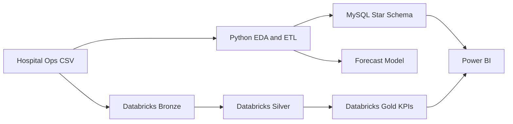

# Team 4 Project Report: Hospital Operations and Resource Management

## Problem Statement

Optimize bed occupancy, ER wait times, and staff shift efficiency across departments using historical hospital operations data.

## Dataset Columns Used

The runnable sample uses:

`visit_id`, `patient_id`, `department`, `arrival_time`, `triage_time`, `doctor_seen_time`, `discharge_time`, `shift`, `staff_id`, `staff_role`, `beds_total`, `beds_occupied`, `patients_seen`.

When the real dataset is available, replace `data/raw/hospital_ops_sample.csv` and keep the same business mapping.

## Methodology

Python performs EDA, timestamp conversion, feature extraction, hourly resampling, occupancy calculation, and shift-wise KPI generation. MySQL stores the analytical star schema. Databricks processes the same data using Bronze, Silver, and Gold layers. Power BI consumes the Gold KPIs for an operations command-center dashboard.

## Key KPIs

- Bed occupancy rate = occupied beds / total beds
- ER wait time = doctor seen time - arrival time
- Triage wait time = triage time - arrival time
- Length of stay = discharge time - arrival time
- Patients per staff = patients seen / active staff count
- Peak load = visits by hour and department

## Architecture

## Outcome

The solution helps operations managers identify departments with high occupancy, long ER wait times, weak staffing ratios, and shift-level bottlenecks.

